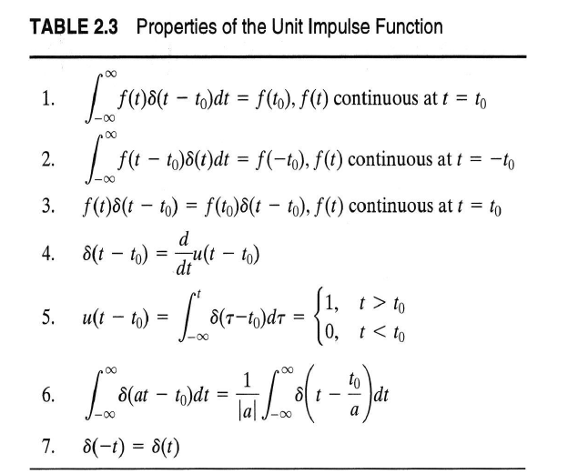
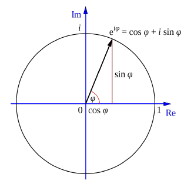
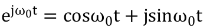

# 3/14

* **Unit Impulse Function**
  * 
* **complex exponential function**
  * 
  * 
    * Prove by Euler
    * &lt;- by Taylor expansion \(a = 0 , Mclawrence\)
      * 大部分訊號只須展開到第三、四項
  * phases \(ωt + θ\)
    * phases delay
    * phases leads
* 
